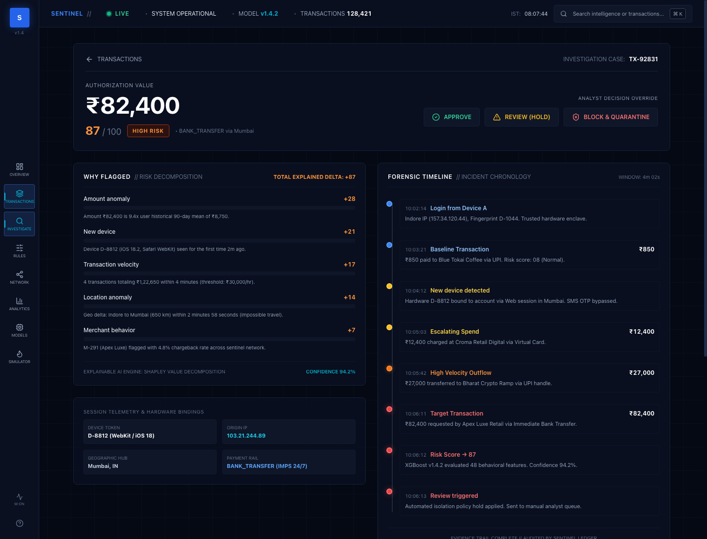

# SENTINEL // Autonomous FinTech Fraud Intelligence Platform

[](https://nextjs.org/)
[](https://www.typescriptlang.org/)
[](https://tailwindcss.com/)
[](https://reactflow.dev/)
[](https://www.framer.com/motion/)
[](https://recharts.org/)

**Sentinel** is a high-precision, real-time transaction intelligence platform UI prototype built for institutional fraud detection, behavioral anomaly isolation, graph forensics, and sub-5ms risk inference.

Engineered with the visual density of Palantir, the financial precision of Stripe, and the tactile micro-interaction fidelity of Linear, Sentinel establishes a complete frontend design system and operational interaction model for high-throughput payment rails, cross-border settlement, and multi-hop fraud syndicates.

---

## Table of Contents

1. [Visual Previews & Interface Gallery](#visual-previews--interface-gallery)
2. [Core Design Philosophy & Visual System](#core-design-philosophy--visual-system)
3. [Key Modules & Platform Capabilities](#key-modules--platform-capabilities)
   - [Cinematic Landing & Signal Story](#1-cinematic-landing--signal-story-)
   - [Transaction Intelligence Overview](#2-transaction-intelligence-overview-dashboard)
   - [Dense Transaction Surveillance Monitor](#3-dense-transaction-surveillance-monitor-transactions)
   - [Declarative Risk Rules Engine](#4-declarative-risk-rules-engine-rules)
   - [Multi-Hop Entity Relationship Graph Forensics](#5-multi-hop-entity-relationship-graph-forensics-network)
   - [Institutional Telemetry & Analytics](#6-institutional-telemetry--analytics-analytics)
   - [Production Machine Learning Model Performance](#7-production-machine-learning-model-performance-models)
   - [Transaction & Attack Escalation Simulator](#8-transaction--attack-escalation-simulator-simulator)
   - [Forensic Case Investigation Deep-Dive](#9-forensic-case-investigation-deep-dive-transactionstx-92831)
4. [Creative & Interaction Innovations](#creative--interaction-innovations)
5. [Keyboard Shortcuts & Command Architecture](#keyboard-shortcuts--command-architecture)
6. [Architecture & Component Directory Map](#architecture--component-directory-map)
7. [Data Models & State Management](#data-models--state-management)
8. [Installation & Local Development](#installation--local-development)
9. [Roadmap to Production Backend Integration](#roadmap-to-production-backend-integration)

---

## Visual Previews & Interface Gallery

### 1. Cinematic Landing & Signal Story (`/`)

*Full-screen narrative landing experience featuring continuous scroll chapters, interactive canvas particle physics, the digital data-constructed bird, and the live pipeline execution cycle.*

---

### 2. Transaction Intelligence Overview (`/dashboard`)

*Real-time pipeline flow (`INGEST` → `SIGNALS` → `FEATURES` → `MODEL` → `RISK 87` → `DECISION REVIEW`), environmental KPI telemetry strip, live sliding event stream, priority case alert, and interactive 24h horizontal risk score spectrum.*

---

### 3. Dense Transaction Surveillance Monitor (`/transactions`)

*Institutional-grade tabular surveillance console featuring instant multi-query search, risk tier filters, automated decision statuses, location hubs, and hardware trust tags with direct route transitions to incident investigations.*

---

### 4. Declarative Risk Rules Engine (`/rules`)

*Visual declarative policy grammar builder (`IF ... AND ... THEN + RISK ACTION`) with active rule toggling (`ENABLED` / `DISABLED`), trigger counters, last-execution telemetries, and historical backtesting simulation.*

---

### 5. Multi-Hop Entity Relationship Graph Forensics (`/network`)

*Interactive graph canvas built on React Flow v12. Features custom technical rectangular nodes (`USER`, `DEVICE`, `TRANSACTION`, `MERCHANT`, `IP`, `LOCATION`, `ACCOUNT`), animated risk-pulsing edges, and a real-time reactive Inspector HUD.*

---

### 6. Institutional Telemetry & Analytics (`/analytics`)

*System-wide risk intelligence featuring 24-hour fraud rate vs. transaction volume correlation, geospatial fraud concentration across Indian metropolitan hubs, payment channel risk rates (UPI, Card, IMPS), and policy decision matrices.*

---

### 7. Production Machine Learning Model Performance (`/models`)

*Production evaluation metrics for XGBoost v1.4.2 (`PR-AUC 0.94`, `Precision 91%`, `Recall 87%`, `F1 89%`, `ROC-AUC 0.97`) paired with normalized SHAP feature importance contribution bars and governance metadata.*

---

### 8. Transaction & Attack Escalation Simulator (`/simulator`)

*Dynamic risk threshold optimizer slider with live trade-off trade balance (Recall vs. False Positives vs. Queue Load vs. Exposure) and an automated 10-step real-time attack replay demonstrating staged account takeover.*

---

### 9. Forensic Case Investigation Deep-Dive (`/transactions/TX-92831`)

*Forensic deep dive for incident `TX-92831` (₹82,400 / 87 HIGH RISK). Features explainable SHAP risk decomposition (`WHY FLAGGED`), chronological forensic timeline, session hardware bindings, and analyst decision overrides (`APPROVE`, `REVIEW`, `BLOCK`).*

---

## Core Design Philosophy & Visual System

### 1. Aesthetic Foundations
- **Zero SaaS Fluff**: No playful illustrations, no bubbly rounded cards, and no distracting gradients. The interface is engineered as mission-critical infrastructure.
- **Surface Hierarchy**:
  - Global Canvas / Void: `#050914`
  - Base Card Surfaces: `#0A1020`
  - Elevated Popovers & Drawers: `#0E1628`
  - Structural Borders: `#1E293B` and `#334155` with low-opacity technical grid overlays
- **4-Tier Risk Grammar**:
  - `LOW` (0–30): Emerald `#10B981` (Normal behavioral baseline)
  - `MEDIUM` (31–60): Amber `#F59E0B` (Minor anomaly, low velocity)
  - `HIGH` (61–85): Orange `#F97316` (Suspicious device binding, velocity spike)
  - `CRITICAL` (86–100): Crimson `#EF4444` (Impossible travel, account drain, synthetic identity)
- **Monospace Financial Telemetry**:
  - Primary UI: Inter / Geist Sans
  - Financial figures, coordinates, transaction hashes, IP addresses, and latencies: JetBrains Mono / IBM Plex Mono

### 2. The Digital Bird Metaphor
At the visual core of Sentinel is the **Digital Bird** (`DigitalBird.tsx`)—an abstract mathematical signature constructed entirely from floating financial data tokens:
```
[ TXN ]   [ 87 ]   [ 0.82 ]   [ RISK ]   [ ₹82,400 ]   [ Δ ]   [ 0x8F21 ]   [ 103.21 ]
```
The bird embodies institutional vision: **soaring at high altitude with wide-spectrum panoptic surveillance**, capable of swooping down with millisecond velocity to isolate microscopic transaction anomalies before balance settlement.

---

## Key Modules & Platform Capabilities

### 1. Cinematic Landing & Signal Story (`/`)
- **Continuous Scroll Storytelling**: Narrative progression through 4 operational chapters:
  1. *Global Surveillance* — Ingesting millions of payment authorizations across UPI, IMPS, and card networks.
  2. *Behavioral Anomaly Isolation* — Extracting 48 real-time behavioral features under 2 milliseconds.
  3. *Graph Forensics* — Uncovering syndicated rings through multi-hop entity resolution.
  4. *Automated Mitigation* — Deterministic rule enforcement and analyst review queues.
- **Canvas Particle Matrix**: Real-time 2D canvas simulating financial transactions circulating across global financial nodes.
- **Interactive Pipeline Cycle (`HeroFlow.tsx`)**: Interactive 5-stage pipeline (`TRANSACTION` → `SIGNALS` → `CONTEXT` → `RISK` → `DECISION`).
- **Mouse Signal Tracker (`MouseSignalTracker.tsx`)**: Secondary lagging technical cursor HUD (~150ms trailing interpolation) showing coordinates, live risk scores, and drifting data fragments.

### 2. Transaction Intelligence Overview (`/dashboard`)
- **System Status Bar**: Displays live engine operational status, active model version (`v1.4.2`), processed volume (`128,421`), pipeline latency (`3.9ms`), and live Indian Standard Time clock (`IST`).
- **Environmental KPI Strip**:
  - `128,421` Total Transactions Analyzed
  - `1,284` Flagged Anomalies Isolated (1.00%)
  - `37` Pending Human Review Queue Load
  - `₹4.82 Lakh` Quarantined Fraud Exposure
  - `0.94` XGBoost Production PR-AUC
- **Pipeline Flow Visualizer (`TransactionFlow.tsx`)**: Step-by-step telemetry through ingestion, behavioral extraction, graph expansion, model inference, anomaly scoring, and policy decision.
- **24-Hour Risk Distribution Spectrum (`RiskDistribution.tsx`)**: Interactive horizontal gradient bar with hover cards revealing transaction volume, percentage share, and financial exposure for each risk bracket.
- **Priority Incident Callout**: Real-time alert card routing analysts directly to high-risk anomalous transactions (e.g., `TX-92831`).
- **Live Sliding Event Stream (`LiveEventStream.tsx`)**: Visual queue updating with newly arrived transaction events.

### 3. Dense Transaction Surveillance Monitor (`/transactions`)
- **Institutional Table Layout**: Engineered for high data density, readability, and speed.
- **Data Columns**: Transaction ID, Timestamp, User ID, Merchant Name, Amount (formatted in Indian Rupees `₹`), Hardware Security Tag (`TRUSTED`, `NEW`, `UNKNOWN`), Metropolitan Hub, Risk Score with inline micro-bar, and Policy Decision Badge (`APPROVE`, `REVIEW`, `BLOCK`).
- **Multi-Faceted Instant Filtering**:
  - Universal text search across ID, User, Merchant, Device Token, and IP.
  - Risk Tier dropdown (`All`, `Low`, `Medium`, `High`, `Critical`).
  - Policy Decision dropdown (`All`, `Approve`, `Review`, `Block`).
  - Geographic Hub dropdown (`All`, `Mumbai`, `Bengaluru`, `Delhi`, `Hyderabad`, `Pune`, `Indore`).
  - Device Reputation dropdown (`All`, `Trusted`, `New`, `Unknown`).
  - Instant `Reset Filters` control.
- **One-Click Case Navigation**: Clicking any transaction row navigates directly to that incident's forensic investigation console.

### 4. Declarative Risk Rules Engine (`/rules`)
- **Visual Policy Grammar Builder**:
  ```
  IF [Transaction Amount] > [₹50,000]
  AND [Device Status] IS [NEW]
  AND [Velocity 10m] > [5]
  THEN [APPLY REVIEW (+30 RISK)]
  ```
- **Active Policy Catalog**:
  - `High Velocity Rapid Escalation` (`REVIEW +30 RISK`) — Detects burst transactions on newly bound hardware.
  - `Impossible Travel Velocity Barrier` (`BLOCK +45 RISK`) — Flags transactions occurring >500km apart within 15 minutes.
  - `New Merchant High Value Outflow` (`REVIEW +20 RISK`) — Monitors large drains to merchants created <7 days ago.
  - `Tor / Datacenter Proxy Egress` (`BLOCK +50 RISK`) — Blocks requests originating from known VPN or hosting nodes.
- **Operational Policy Controls**: Real-time policy toggles (`ENABLED` / `DISABLED`), trigger metrics, and execution history.
- **Interactive Action Bar**: Includes `TEST RULE`, `BACKTEST HISTORICAL`, and `SAVE POLICY` buttons.

### 5. Multi-Hop Entity Relationship Graph Forensics (`/network`)
- **React Flow v12 Engine**: Hardware-accelerated canvas supporting pan, zoom, drag, and auto-fit.
- **Node Topology**:
  - `USER`: Primary account identity (KYC status, account tenure).
  - `DEVICE`: Hardware fingerprint and enclave binding (`D-1044`, `D-8812`).
  - `TRANSACTION`: Monetary authorization node (`TX-92831`).
  - `MERCHANT`: Receiving terminal or gateway (`M-291 Apex Luxe`).
  - `IP`: Network origin address and hosting classification (`103.21.244.89`).
  - `LOCATION`: Geographic geolocation hub (`Mumbai, IN` / `Indore, IN`).
  - `ACCOUNT`: Financial settlement account (`ACC-49102`).
- **Visual Anomalies**: Risky relationships are rendered with animated dashed blue/crimson edges.
- **Reactive Inspector HUD**: Clicking any graph node immediately populates a detailed metadata side panel with node credentials, risk tier, cluster categorization, and connection degree.

### 6. Institutional Telemetry & Analytics (`/analytics`)
- **24-Hour Fraud Rate vs. Volume Correlation**: Dual-axis area chart illustrating overall transaction volume curve against anomaly spikes.
- **Policy Decision Matrix**: Live breakdown bars for automated decisions:
  - `APPROVE`: 96.2% (123,512 transactions)
  - `REVIEW`: 2.8% (3,595 transactions)
  - `BLOCK`: 1.0% (1,314 transactions)
  - Automated policy enforcement accuracy: `99.92%`
- **Geospatial Incident Distribution**: Bar chart ranking risk density across major financial hubs: Mumbai, Delhi, Bengaluru, Hyderabad, Pune, and Indore.
- **Payment Channel Vulnerability Telemetry**: Real-time fraud rates and network volume shares across payment rails:
  - `UPI`: 2.4% Fraud Rate (58% Network Volume)
  - `CARDS`: 1.8% Fraud Rate (26% Network Volume)
  - `IMPS / NEFT`: 3.2% Fraud Rate (12% Network Volume)
  - `NET BANKING`: 0.9% Fraud Rate (4% Network Volume)

### 7. Production Machine Learning Model Performance (`/models`)
- **Architecture**: `XGBoost v1.4.2-prod` Gradient Boosted Decision Forest with Neural Graph Embeddings.
- **Production Metric Cards**:
  - **PR-AUC**: `0.94` (Area under Precision-Recall curve)
  - **Precision**: `91%` (True positive accuracy)
  - **Recall**: `87%` (Fraud capture sensitivity)
  - **F1 Score**: `89%` (Harmonic balance)
  - **ROC-AUC**: `0.97` (Global discriminability)
- **SHAP Feature Importance Contribution Ranking**:
  1. `velocity_10m` — 28.0% contribution
  2. `amount_vs_user_avg` — 22.0% contribution
  3. `device_trust_score` — 18.0% contribution
  4. `geo_velocity_kmh` — 14.0% contribution
  5. `merchant_chargeback_rate` — 10.0% contribution
- **Model Governance Strip**: 4,820,000 labeled transactions in training set, 4.2ms p99 inference latency, daily automated retraining schedule.

### 8. Transaction & Attack Escalation Simulator (`/simulator`)
- **Risk Threshold Optimizer**: Interactive slider allowing fraud operations leaders to dynamically stress-test the risk cutoff score (0 to 100 with marked Optimal Zone at 65–75):
  - Recalculates Fraud Recall, False Positive Rate, Review Queue Load (cases/hr), and Potential Financial Leakage in real time.
- **10-Step Attack Replay**: Staged scenario simulating a credential-stuffing attack:
  1. `01 NORMAL LOGIN` — Authenticated in Indore on trusted device `D-1044`.
  2. `02 ₹850` — Morning coffee baseline purchase.
  3. `03 NEW DEVICE` — Unverified token `D-8812` bound via WebKit in Mumbai.
  4. `04 ₹12,400` — Virtual card electronics store spend.
  5. `05 ₹27,000` — Crypto ramp outflow via UPI.
  6. `06 ₹82,400` — High-value IMPS drain attempt.
  7. `07 LOCATION ANOMALY` — Indore to Mumbai (650 km) in 2m 58s (impossible travel).
  8. `08 HIGH VELOCITY` — 4 rapid escalations within 4 minutes.
  9. `09 RISK 87` — ML ensemble and rules trigger CRITICAL alert.
  10. `10 MANUAL REVIEW` — Transaction quarantined, preventing fund loss.
- **Interactive Controls**: `SIMULATE ATTACK`, `GENERATE NORMAL`, `GENERATE HIGH RISK`, and `CLEAR BUFFER`.

### 9. Forensic Case Investigation Deep-Dive (`/transactions/[id]`)
- **Analyst Decision Override Panel**:
  - `APPROVE` — Whitelist transaction and dispatch funds immediately.
  - `REVIEW (HOLD)` — Freeze authorization and dispatch verification challenge.
  - `BLOCK & QUARANTINE` — Sever session, blacklist device token, and quarantine funds.
- **Explainable SHAP Risk Decomposition (`WHY FLAGGED`)**:
  - Base Score: `0`
  - Amount anomaly (9.4x 90-day mean): `+28`
  - New device token (bound 2m ago): `+21`
  - Velocity spike (₹1.22L in 4m): `+17`
  - Impossible travel delta (650 km in 2m 58s): `+14`
  - High-risk merchant chargeback: `+7`
  - Total Explained Delta: `+87` (Confidence: 94.2%)
- **Chronological Incident Timeline**: Complete millisecond-level chain of evidence from initial login to policy enforcement.
- **Hardware & Network Telemetry**: Device token (`D-8812 / iOS 18.2`), IP (`103.21.244.89 Mumbai Datacenter`), and payment rail (`IMPS 24/7`).

---

## Creative & Interaction Innovations

1. **Ambient Motion Toggle (`M:ON` / `M:OFF`)**: Global switch in the bottom-left sidebar allowing users to toggle intensive background animations, particle physics, and coordinate trackers.
2. **Technical Grid Overlays**: High-tech coordinate grid backgrounds built with SVG data-URI patterns for an authentic radar / intelligence aesthetic.
3. **Sound FX Ready Architecture**: Audio stubs configured for key operational triggers (critical risk flags, incident isolation, simulator stepping).
4. **Fluid Page Transitions**: Zero layout shift, instantaneous Next.js client-side routing, and responsive layouts calibrated for laptop screens and high-resolution command monitors.

---

## Keyboard Shortcuts & Command Architecture

Sentinel features full keyboard operability for institutional command centers:

| Key Binding | Action | Target Destination |
| :--- | :--- | :--- |
| `⌘ K` or `Ctrl K` | Open Global Command Palette | Quick-launch modal |
| `G` `D` | Go to Dashboard | `/dashboard` |
| `G` `T` | Go to Transaction Monitor | `/transactions` |
| `G` `I` | Open Primary Case Investigation | `/transactions/TX-92831` |
| `G` `R` | Open Risk Rules Engine | `/rules` |
| `G` `N` | Open Entity Network Graph | `/network` |
| `G` `A` | Open Analytics & Telemetry | `/analytics` |
| `G` `S` | Open Attack Simulator | `/simulator` |
| `?` | Toggle Keyboard Shortcuts Modal | Operational cheat sheet |
| `ESC` | Dismiss Modals / Overlays | Close current drawer |

---

## Architecture & Component Directory Map

```
sentinel/
├── app/
│   ├── (platform)/                     # Main platform authenticated layout
│   │   ├── analytics/page.tsx          # Institutional telemetry & charts
│   │   ├── dashboard/page.tsx          # Real-time overview & KPI strip
│   │   ├── layout.tsx                  # Rail nav, header, shortcuts provider
│   │   ├── models/page.tsx             # XGBoost model metrics & SHAP bars
│   │   ├── network/page.tsx            # React Flow v12 entity graph
│   │   ├── rules/page.tsx              # Declarative risk policy builder
│   │   ├── simulator/page.tsx          # Attack sequence replay & optimizer
│   │   └── transactions/
│   │       ├── [id]/page.tsx           # Forensic case deep-dive (TX-92831)
│   │       └── page.tsx                # Dense transaction surveillance table
│   ├── globals.css                     # Dark-mode variables & grid patterns
│   ├── layout.tsx                      # Root layout & font configurations
│   └── page.tsx                        # Cinematic landing & scroll narrative
├── components/
│   ├── analytics/
│   │   └── AnalyticsView.tsx           # Recharts volume, hub & payment graphs
│   ├── creative/
│   │   ├── DataParticles.tsx           # 2D canvas transaction particle field
│   │   ├── DigitalBird.tsx             # Floating data-token bird animation
│   │   ├── HeroFlow.tsx                # Animated 5-step pipeline component
│   │   ├── MouseSignalTracker.tsx      # Trailing coordinate cursor HUD
│   │   └── ScrollStory.tsx             # Continuous 4-chapter scroll story
│   ├── dashboard/
│   │   ├── KpiStrip.tsx                # Environmental KPI cards
│   │   ├── LiveEventStream.tsx         # Real-time event feed ticker
│   │   ├── RiskDistribution.tsx        # Horizontal 24h risk score spectrum
│   │   ├── SystemStatus.tsx            # Live system status & clock strip
│   │   └── TransactionFlow.tsx         # Micro-stage pipeline latency steps
│   ├── investigation/
│   │   ├── DecisionPanel.tsx           # Analyst override action buttons
│   │   ├── RiskBreakdown.tsx           # SHAP explainability waterfall
│   │   └── Timeline.tsx                # Chronological forensic incident log
│   ├── models/
│   │   └── ModelPerformance.tsx        # PR-AUC, ROC-AUC, SHAP feature rankings
│   ├── navigation/
│   │   ├── CommandPalette.tsx          # ⌘K search & quick-jump modal
│   │   ├── DashboardHeader.tsx         # Platform top navigation bar
│   │   ├── DashboardNavRail.tsx        # Left-hand operational icon rail
│   │   ├── EnterSentinelButton.tsx     # Animated CTA button
│   │   ├── KeyboardShortcuts.tsx       # Keybinding modal dialog (?)
│   │   └── LandingNav.tsx              # Top navigation for public landing
│   ├── network/
│   │   └── EntityGraph.tsx             # React Flow custom nodes & Inspector
│   ├── rules/
│   │   └── RuleBuilder.tsx             # Visual declarative grammar builder
│   ├── simulator/
│   │   └── SimulatorView.tsx           # Dynamic threshold slider & attack replay
│   ├── transactions/
│   │   ├── RiskIndicator.tsx           # Color-coded risk badge & mini-bar
│   │   ├── TransactionFilters.tsx      # Multi-dimensional filter toolbar
│   │   └── TransactionTable.tsx        # High-density surveillance table
│   └── ui/
│       └── SystemBootLoader.tsx        # Tactical system boot animation
├── lib/
│   ├── context.tsx                     # SentinelProvider (motion, state, audio)
│   ├── mock-data.ts                    # Realistic financial transactions & graphs
│   └── utils.ts                        # Tailwind merge & currency formatters
├── Screenshot/                         # High-resolution Retina captures
└── docs/screenshots/                   # Documentation image assets
```

---

## Data Models & State Management

Sentinel utilizes strongly typed TypeScript schemas for all platform operations:

### 1. Transaction Entity
```typescript
export interface Transaction {
  id: string;               // e.g. "TX-92831"
  timestamp: string;        // e.g. "10:06:13"
  userId: string;           // e.g. "U-1932"
  userName: string;         // e.g. "Ananya Sharma"
  merchantId: string;       // e.g. "M-291"
  merchantName: string;     // e.g. "Apex Luxe Retail"
  amount: number;           // e.g. 82400 (INR)
  currency: string;         // "INR"
  paymentRail: string;      // "UPI" | "CARD" | "IMPS" | "NET_BANKING"
  deviceToken: string;      // "D-8812"
  deviceTrust: 'trusted' | 'new' | 'unknown';
  originIp: string;         // "103.21.244.89"
  location: string;         // "Mumbai"
  riskScore: number;        // 0 - 100
  riskTier: 'low' | 'medium' | 'high' | 'critical';
  decision: 'approve' | 'review' | 'block';
  flags: string[];          // ["impossible_travel", "velocity_burst", "new_device"]
}
```

### 2. Explainable SHAP Factor
```typescript
export interface RiskFactor {
  name: string;             // e.g. "Amount anomaly"
  delta: number;            // e.g. +28
  description: string;      // "Amount ₹82,400 is 9.4x user historical 90-day mean"
  category: 'amount' | 'velocity' | 'device' | 'geo' | 'merchant';
}
```

### 3. Declarative Risk Rule
```typescript
export interface RiskRule {
  id: string;               // "R-101"
  name: string;             // "High Velocity Rapid Escalation"
  description: string;      // "Detects burst transactions over ₹50k on new hardware"
  conditions: {
    field: string;          // "Transaction amount"
    operator: '>' | '<' | '==' | 'is';
    value: string | number; // "50000"
  }[];
  action: 'approve' | 'review' | 'block';
  riskScoreDelta: number;   // +30
  enabled: boolean;         // true / false
  triggerCount: number;     // 142
  lastTriggered: string;    // "10:06:13"
}
```

---

## Installation & Local Development

### Prerequisites
- **Node.js**: `v18.17.0` or higher
- **npm** / **yarn** / **pnpm**

### Step-by-Step Setup

```bash
# 1. Clone the repository
git clone https://github.com/your-org/sentinel.git
cd sentinel

# 2. Install dependencies
npm install

# 3. Start the Next.js development server
npm run dev

# 4. Open in browser
open http://localhost:3000
```

### Production Build Validation

```bash
# Build the optimized production bundle
npm run build

# Start the production server
npm run start
```

---

## Roadmap to Production Backend Integration

Sentinel was created with clean modular boundaries to allow seamless replacement of mock data modules with real production microservices:

1. **Streaming Data Ingestion**:
   - Replace `lib/mock-data.ts` event emitters with **Apache Kafka** or **AWS Kinesis** consumer streams via WebSockets or Server-Sent Events (SSE).
2. **Sub-5ms Inference Gateway**:
   - Connect the pipeline stages directly to a **Triton Inference Server** or **ONNX Runtime** hosting production XGBoost and Graph Neural Network models.
3. **Distributed Graph Database**:
   - Replace static node layouts with live multi-hop queries executing against **Neo4j**, **Amazon Neptune**, or **Memgraph** for real-time syndicated fraud ring discovery.
4. **Deterministic Policy Engine**:
   - Connect the Declarative Rule Builder (`/rules`) to a centralized rule management engine (such as **Drools** or a custom Go/Rust AST evaluator) evaluating rules at wire speed.
5. **Cold Storage & Audit Ledger**:
   - Stream immutable incident audit logs and analyst overrides to **ClickHouse** or **Snowflake** for regulatory compliance and model retraining corpora.

---

## License

Institutional Proprietary — Designed & Developed for Sentinel Intelligence Systems. All rights reserved.
